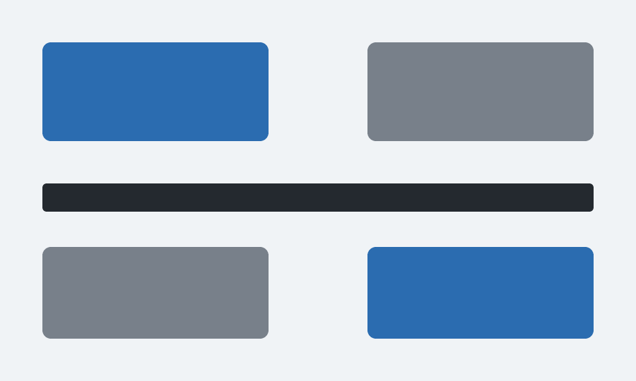

<!-- _class: title -->
<!-- _paginate: false -->

<!--
画像パスはこのファイルからの相対。output/ にコピーしたら `../` を足す。
`.images/figure_sample.png` → `../.images/figure_sample.png`
表紙に背景画像は敷かない。
-->

# プレゼンテーションのタイトル

## サブタイトル / 発表者 / YYYY-MM-DD

---

## このスライドで伝えたいこと

- 聞き手は誰か
- 聞き手に何をしてほしいか
- 一番伝えたいこと

<!--
このスライドは下書き用。完成時は削除するか、アジェンダに置き換える。
-->

---

<!-- _class: section-divider -->

# 第1章のタイトル

---

## 見出しは主張にする

見出しだけを拾い読みして話の筋が通るなら、構成は正しい。

- 本文は箇条書き中心にする
- 1行は40文字以内
- 6行を超えたらスライドを分割する

**強調はここぞという1箇所だけ**に使う。

---

<p class="label">CALLOUT</p>

## 一番言いたい1文は囲む

<div class="callout">

**結論を先に置く。** 理由と根拠はそのあとに並べる。

</div>

囲むのは1スライドに1つまで。2つ置くとどちらも目立たなくなる。見出しの上のラベルは、章の名前や区分を添えるのに使う。

---

## 並列の項目はカードに載せる

<div class="cards">
<div>

### 前提

置かれている状況。揃っていないと先に進めない。

</div>
<div>

### 課題

何が問題か。1枚に1つだけ書く。

</div>
<div>

### 打ち手

どうするか。次のアクションにつなげる。

</div>
</div>

---

## 数値は文章に埋めず、数値として見せる

<div class="stats">
<div>

**3秒**

処理時間（変更前は12秒）

</div>
<div>

**400MB**

ピークメモリ（同 1.2GB）

</div>
<div>

**2人日**

削減できた月あたりの工数

</div>
</div>

数字の下の1行には、その数字が何かを必ず書く。

---

## 手順は番号を振る

<div class="steps">

1. 原稿を `input/` に置く
2. ルールを読んでから構成を決める
3. png に書き出して目視で確認する
4. 直してから PDF にする

</div>

番号は自動で振られる。markdown 側は `1.` を並べるだけでよい。

---

## コードは言語名を付ける

設定値はファイルパスと変数名をセットで示す。

`path/to/config.py`

```python
# 何のための値かをコメントで補う
RETRY_LIMIT = 3
```

インラインは `variable_name` のように書く。

---

## 図は説明と分ける

図を載せるスライドには、図だけを置く。本文と同居させると下端からはみ出す。

このスライドで説明し、次のスライドで図を見せる。

---

<!-- _class: figure-full -->

## 図は説明と分ける

図には、何を見てほしいのかを1行添える。



---

## 2カラムに並べる

<div class="columns">
<div>

**左のカラム**

- 対比させたい項目
- 短い箇条書き向き

</div>
<div>

**右のカラム**

- 長い文章には向かない
- 収まらなければ2枚に割る

</div>
</div>

---

## 3カラムに並べる

<div class="columns-3">
<div>

**左**

短い語句向き

</div>
<div>

**中**

文章は入らない

</div>
<div>

**右**

4つ目は作れない

</div>
</div>

---

## 表で比較する

| 項目 | Before | After |
| --- | --- | --- |
| 処理時間 | 12秒 | 3秒 |
| メモリ | 1.2GB | 400MB |

数値には単位と、それが固定値か可変かを添える。

---

## 引用は出典を添える

> 見出しだけを拾い読みして話の筋が通るなら、構成は正しい。

出典 — 社内スライド作成ルール

---

<!-- _class: lead -->

## まとめ

伝えたかったこと + 次のアクション
