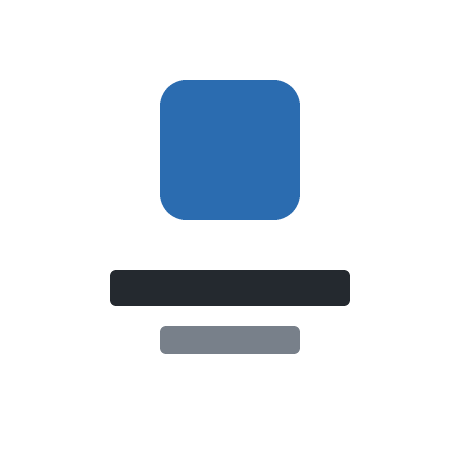

<!-- _class: title -->
<!-- _paginate: false -->


<!--
画像パスはこのファイルからの相対。output/ にコピーしたら `../` を足す。
`.images/background.png` → `../.images/background.png`
-->

# プレゼンテーションのタイトル

## サブタイトル / 発表者 / YYYY-MM-DD

---

## このスライドで伝えたいこと

- 聞き手は誰か
- 聞き手に何をしてほしいか
- 一番伝えたいこと

<!--
このスライドは下書き用。完成時は削除するか、アジェンダに置き換える。
-->

---

<!-- _class: section-divider -->

# 第1章のタイトル

---

## 見出しは主張にする

見出しだけを拾い読みして話の筋が通るなら、構成は正しい。

- 本文は箇条書き中心にする
- 1行は40文字以内
- 6行を超えたらスライドを分割する

**強調はここぞという1箇所だけ**に使う。

---

## コードは言語名を付ける

設定値はファイルパスと変数名をセットで示す。

`path/to/config.py`

```python
# 何のための値かをコメントで補う
RETRY_LIMIT = 3
```

インラインは `variable_name` のように書く。

---

## 図は説明と分ける

図を載せるスライドには、図だけを置く。
本文と同居させると下端からはみ出す。

このスライドで説明し、次のスライドで図を見せる。

---

<!-- _class: figure-full -->

## 図は説明と分ける

図には、何を見てほしいのかを1行添える。


---

<!-- _class: figure-plain -->

## 透過PNGは影と角丸を消す

背景が透過している図解やロゴは `figure-plain` を使う。



---

## 2カラムに並べる

<div class="columns">
<div>

**左のカラム**

- 対比させたい項目
- 短い箇条書き向き

</div>
<div>

**右のカラム**

- 長い文章には向かない
- 収まらなければ2枚に割る

</div>
</div>

---

## 3カラムに並べる

<div class="columns-3">
<div>

**左**

短い語句向き

</div>
<div>

**中**

文章は入らない

</div>
<div>

**右**

4つ目は作れない

</div>
</div>

---

## 表で比較する

| 項目 | Before | After |
| --- | --- | --- |
| 処理時間 | 12秒 | 3秒 |
| メモリ | 1.2GB | 400MB |

数値には単位と、それが固定値か可変かを添える。

---

<!-- _class: lead -->

## まとめ

伝えたかったこと + 次のアクション
